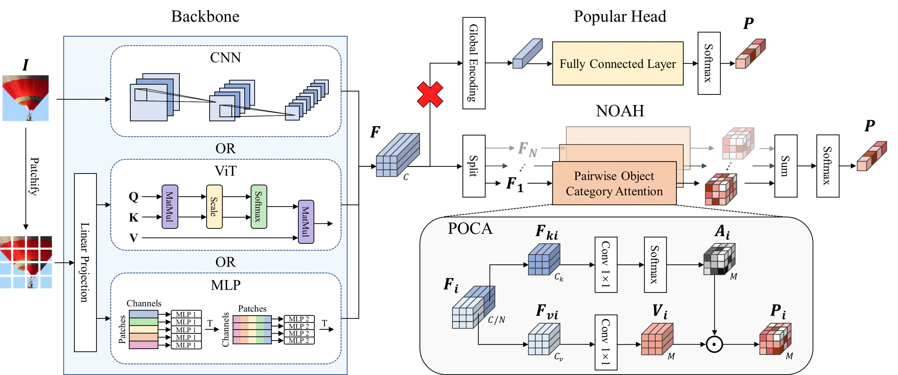

# Non-glObal Attentive Head

This repository is an official implementation of "NOAH: Learning Pairwise Object Category Attentions for Image Classification". <!-- Experiments are conducted on the [ILSVRC 2012](http://www.image-net.org) benchmark.-->

<p align="center"></p>
The macro-structure of DNNs with a Non-glObal Attentive Head (NOAH). Unlike popular heads based on the global feature encoding, NOAH relies on Pairwise Object Category Attentions (POCAs) learnt at local to global scales via a neat association of feature split (two levels), interaction and aggregation operations, taking the feature maps from the last layer of a CNN, ViT or MLP backbone as the input.

## Dataset

Following [this repository](https://github.com/pytorch/examples/tree/master/imagenet#requirements),

- Download the ImageNet dataset from http://www.image-net.org/.
- Then, move and extract the training and validation images to labeled subfolders, using [the following script](https://github.com/pytorch/examples/blob/main/imagenet/extract_ILSVRC.sh).

## Requirements

- Python >= 3.7.0
- PyTorch >= 1.8.1
- torchvision >= 0.9.1

## Results and Models

In the experiments, we construct our networks by replacing the existing head of each selected DNN architecture by a NOAH.

## Training and evaluation on CNN, ViT and MLP

#### Please refer to README.md in the folders of [vit](vit) and [mlp](mlp) on how to train/evaluate ViT and MLP backbones with NOAH. 

Here, we show the results and models for CNN backbones with NOAH trained on ImageNet. 

| Backbones | Params | $N$ | $r$ | Top-1 Acc(%) | Google Drive                                                                                |
|:--------- |:------:|:---:|:---:|:------------:|:-------------------------------------------------------------------------------------------:|
| ResNet18  | 11.69M | -   | -   | 70.25        | [model](https://drive.google.com/file/d/1K5i2HM4o1wQPyv64GXAkEKSQAOEiOKjJ/view?usp=sharing) |
| + NOAH    | 11.70M | 4   | 1/2 | 71.81        | [model](https://drive.google.com/file/d/1G1FWERwP-bRp7-ykqSk0yfSOKSnkXNPm/view?usp=sharing) |
| ResNet50  | 25.56M | -   | -   | 76.23        | [model](https://drive.google.com/file/d/1c1S174i96QAkeWeX422ydQFFCl0jb92c/view?usp=sharing) |
| + NOAH    | 25.56M | 4   | 1/8 | 77.25        | [model](https://drive.google.com/file/d/1DmPnel6Rai3KLIREwx2eAkyj-YM1gvj2/view?usp=sharing) |
| ResNet101 | 44.55M | -   | -   | 77.41        | [model](https://drive.google.com/file/d/1Ix4YfZU8Cuh6ZJ0NmdtDWI04Hcg_MR7l/view?usp=sharing) |
| + NOAH    | 44.56M | 4   | 1/8 | 78.22        | [model](https://drive.google.com/file/d/1UlL7uOhQOQiqSGg5m1jHBaI7PiN49VTU/view?usp=sharing) |
| ResNet152 | 60.19M | -   | -   | 78.16        | [model](https://drive.google.com/file/d/1y1AUkHRiR-bjiJ-SMA_YIaaiaosvAvCe/view?usp=sharing) |
| + NOAH    | 60.20M | 4   | 1/8 | 78.57        | [model](https://drive.google.com/file/d/15-If0bsZOE8wogItrkbopIh02amuhVio/view?usp=sharing) |

| Backbones           | Params | $N$ | $r$ | Top-1 Acc(%) | Google Drive                                                                                |
|:------------------- |:------:|:---:|:---:|:------------:|:-------------------------------------------------------------------------------------------:|
| MobileNetV2 (1.0×)  | 3.50M  | -   | -   | 72.02        | [model](https://drive.google.com/file/d/1SyV8gB_1wYKa_LhB8yB7eH8vWVVwEzfG/view?usp=sharing) |
| + NOAH              | 3.52M  | 8   | 1/4 | 73.35        | [model](https://drive.google.com/file/d/1npeyGbDtM978vU14aXy1lbrVD7gOrwyp/view?usp=sharing) |
| MobileNetV2 (0.75×) | 2.64M  | -   | -   | 69.65        | [model](https://drive.google.com/file/d/1QsYwEtpeVDOlhqDNsVZBsynVKjZBmcW7/view?usp=sharing) |
| + NOAH              | 2.65M  | 8   | 1/4 | 71.44        | [model](https://drive.google.com/file/d/1xE-f7kEAo9F2Xvqt8N0f4A736mdneHsE/view?usp=sharing) |
| MobileNetV2 (0.5×)  | 1.97M  | -   | -   | 64.30        | [model](https://drive.google.com/file/d/1Cet7BFh5sgAGXrFJ_0LkTJSVLq0aD__0/view?usp=sharing) |
| + NOAH              | 1.98M  | 8   | 1/4 | 67.44        | [model](https://drive.google.com/file/d/1MTJH8_gsS4p4ONRbkl0hOpQXwUWYwlW8/view?usp=sharing) |
| MobileNetV2 (0.35×) | 1.68M  | -   | -   | 59.62        | [model](https://drive.google.com/file/d/1j9ONdi0riX7UM-UqiZLC5sRdtvd6e3it/view?usp=sharing) |
| + NOAH              | 1.69M  | 8   | 1/4 | 63.40        | [model](https://drive.google.com/file/d/1MJmROWDA_xWv6M2-swl16WMa4jYdRxMJ/view?usp=sharing) |
| MobileNetV3-Small   | 2.94M  | -   | -   | 67.11        | [model](https://drive.google.com/file/d/1pnHomFwpOvh935uvxdvKfWo0Nix-nPJH/view?usp=sharing) |
| + NOAH              | 2.95M  | 8   | 1/4 | 68.92        | [model](https://drive.google.com/file/d/1uFOV7Qa_IjY6clW6av0Nj4i0H87evobJ/view?usp=sharing) |
| ShuffleNetV2 (1.0×) | 2.28M  | -   | -   | 69.43        | [model](https://drive.google.com/file/d/1Sa5jkeotyYkL1QXRcxhSLwaJ0Oq8i1O2/view?usp=sharing) |
| + NOAH              | 2.29M  | 8   | 1/4 | 70.72        | [model](https://drive.google.com/file/d/1F1iSWcaqDvLy32pCBnUAHsXvNufudawL/view?usp=sharing) |

## Training

To train ResNet18 with NOAH $(N=4, r=1/2)$:

```shell
python -m torch.distributed.launch --nproc_per_node=8 main.py --arch resnet18 --epochs 100 --lr 0.1 --wd 1e-4 \
--lr-decay schedule --schedule 30 60 90 --use_noah --head_num 4 --key_ratio 0.5 --dropout 0.1 \
--data ./datasets/ILSVRC2012 --checkpoint ./checkpoints/noah_resnet18 
```

To train ResNet18 with standard head (GAP + FC):

```shell
python -m torch.distributed.launch --nproc_per_node=8 main.py --arch resnet18 --epochs 100 --lr 0.1 --wd 1e-4 \
--lr-decay schedule --schedule 30 60 90 --dropout 0.1 --data ./datasets/ILSVRC2012 --checkpoint ./checkpoints/resnet18 
```

To train MobileNetV2 (1.0×) with NOAH $(N=8, r=1/4)$:

```shell
python -m torch.distributed.launch --nproc_per_node=8 main.py --arch mobilenetv2_100 --epochs 150 --lr 0.05 --wd 4e-5 \
--lr-decay cos --use_noah --head_num 8 --key_ratio 0.25 --dropout 0.2 \
--data ./datasets/ILSVRC2012 --checkpoint ./checkpoints/noah_mobilenetv2_100
```

To train MobileNetV3-Small with NOAH $(N=8, r=1/4)$:

```shell
python -m torch.distributed.launch --nproc_per_node=8 main.py --arch mobilenetv3_small --epochs 150 --lr 0.05 --wd 4e-5 \
--lr-decay cos --use_noah --head_num 8 --key_ratio 0.25 --dropout 0.2  --nowd-bn \
--data ./datasets/ILSVRC2012 --checkpoint ./checkpoints/noah_mobilenetv3_small
```

To train ShuffleNetV2 (1.0×) with NOAH $(N=8, r=1/4)$:

```shell
python -m torch.distributed.launch --nproc_per_node=8 main.py --arch shufflenetv2_100 --epochs 240 --lr 0.5 --wd 4e-5 \
--train-batch 1024 --lr-decay linear --use_noah --head_num 8 --key_ratio 0.25 --dropout 0 --nowd-bn \
--data ./datasets/ILSVRC2012 --checkpoint ./checkpoints/noah_shufflenetv2_100
```

## Evaluation

To evaluate a pre-trained model:

```shell
python -m torch.distributed.launch --nproc_per_node={ngpus} main.py \
--arch {model name} --data {path to dataset} --use_noah --head_num {number of heads} \
--key_ratio {key ratio of POCA} --evaluate --resume {path to model}
```

## License

NOAH is released under the Apache license. We encourage use for both research and commercial purposes, as long as proper attribution is given.

## Acknowledgment

This repository is built based on [pytorch-image-models](https://github.com/huggingface/pytorch-image-models), [deit](https://github.com/facebookresearch/deit), [pvt](https://github.com/whai362/PVT) repositories. We thank the authors for releasing their amazing codes.
